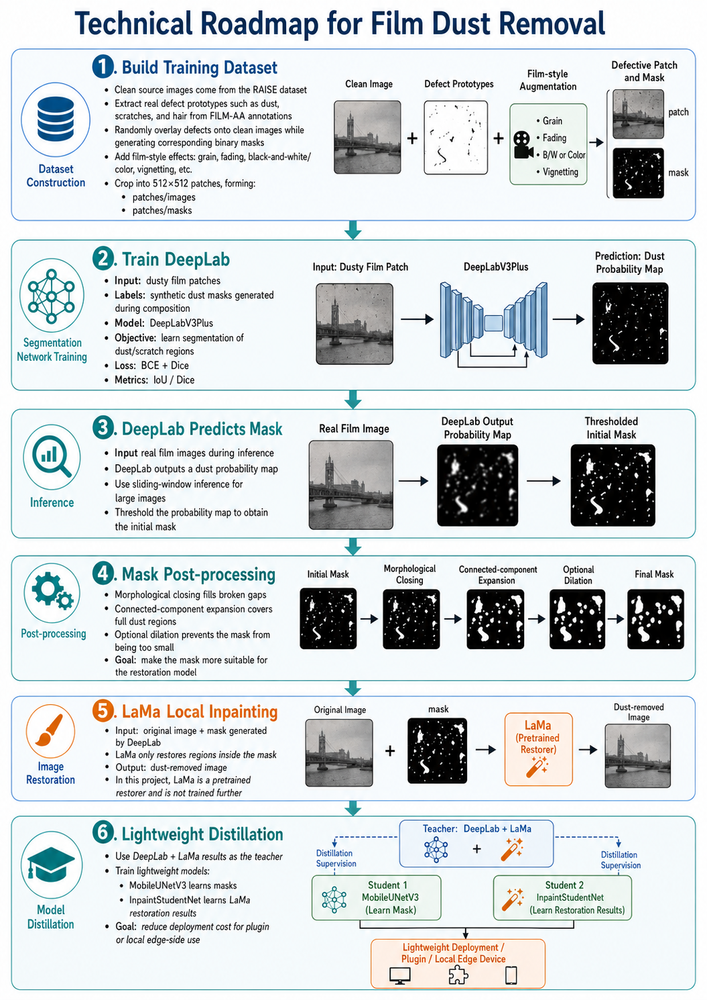

# LAMALocal

[中文](docs/README.zh-CN.md)

LAMALocal is a local workflow for dust and scratch removal on film scans.  
This repository contains model training scripts, inference tools, export utilities, and packaging helpers for the Lightroom plugin workflow.



## What this project includes

- DeepLab-based dust mask prediction
- Local LaMa inpainting for cleanup
- Mobile model distillation and export
- Dataset preparation scripts for training
- PowerShell helpers for packaging and repeated training tasks

## Environment setup

Create and activate a Python environment, then install dependencies:

```powershell
python -m venv .venv
.\.venv\Scripts\activate
pip install -r requirements.txt
```

Run commands from the repository root unless noted otherwise.

## Training dataset

If you want to reproduce training locally, download the prepared dataset from the Baidu Netdisk link below:

- File: `Dataset.zip`
- Link: `https://pan.baidu.com/s/1xR4B9weKeHp_P7dTsFUw7w`
- Extraction code: `cru3`

After extraction, place the `Dataset/` directory in the repository root.

## Common usage

### 1. Train DeepLab on a dataset

```powershell
python -m scripts.train_deeplab_dataset `
  --image-dir Dataset\FakeFilmBW\patches\images `
  --mask-dir Dataset\FakeFilmBW\patches\masks `
  --output-prefix checkpoints\fakefilmbw_deeplab
```

### 2. Run local inference with DeepLab + LaMa

```powershell
python -m scripts.infer_deeplab_lama `
  --input path\to\images `
  --output-dir outputs\deeplab_lama
```

### 3. Train the mobile inpainting student model

```powershell
python -m scripts.train_inpaint_distill `
  --target-dir path\to\lama_teacher_outputs
```

### 4. Export a mobile model

```powershell
python -m scripts.export_mobile `
  --model seg `
  --checkpoint checkpoints\fakefilmcolor_deeplab_best.pth `
  --output outputs\mobile\seg_model.ts
```

## PowerShell helpers

The `tools/` directory contains helper scripts for repeated local workflows:

```powershell
.\tools\train_fakefilm_sequential.ps1
.\tools\build_lightroom.ps1
```

## Build the Windows web package

Build a one-click Windows web app package:

```powershell
.\.venv\Scripts\python.exe -m pip install pyinstaller
.\tools\build_windows_web.ps1 -Clean -Zip
```

Build a smaller CPU-only package:

```powershell
.\tools\build_windows_web_cpu.ps1 -Clean -Zip
```

Output location:

- `dist\LAMALocalWeb\Start LAMALocal Web.bat`
- optional zip: `dist\LAMALocalWeb.zip`
- CPU-only zip: `dist\LAMALocalWeb-CPU.zip`

When launched, the package detects `nvidia-smi` and lets the user choose Auto, GPU/CUDA, or CPU mode before opening the local browser UI.

## Build the Lightroom plugin

This repository includes a Lightroom plugin packaging workflow.

## Prebuilt Lightroom plugin

If you want to try the current plugin package directly, use the Baidu Netdisk link below:

- File: `LAMALocalDust.lrplugin.zip`
- Link: `https://pan.baidu.com/s/17JvMyCRf9rX1DLEEuTx3Hw`
- Extraction code: `ehs9`

### 1. Build the `.lrplugin` package

Use the packaging helper below:

```powershell
.\tools\build_lightroom.ps1
```

If you also want a zip archive:

```powershell
.\tools\build_lightroom.ps1 -Zip
```

Output location:

- `dist\LAMALocalDust.lrplugin`
- optional: `dist\LAMALocalDust.lrplugin.zip`

Required files before packaging:

- `LAMALocalDust.lrplugin\` source plugin directory
- `checkpoints\best_model.pth`
- `model_cache\hub\checkpoints\big-lama.pt`
- `scripts\infer_deeplab_lama.py`

### 2. Build the plugin executable payload

If you also want to bundle the executable payload, run:

```powershell
.\tools\build_lightroom.ps1 -BuildExe
```

You can build the package, executable payload, and zip archive in one pass:

```powershell
.\tools\build_lightroom.ps1 -BuildExe -Zip
```

Output location:

- `dist\LAMALocalDust.lrplugin\bin\LAMALocalDust\LAMALocalDust.exe`

## Project structure

- `lamalocal/`: core package with config, datasets, models, metrics, losses, and shared utilities
- `scripts/`: Python entrypoints for training, inference, export, and data preparation
- `tools/`: PowerShell helper scripts
- `docs/`: additional documentation
- `Dataset/`: local datasets
- `checkpoints/`: saved model checkpoints
- `logs/`: training and tool logs
- `model_cache/`: cached model weights
- `outputs/`: inference and export outputs
- `build/`, `dist/`: packaging artifacts

## Notes

- Some scripts expect local model files and datasets to already exist.
- Default paths in a few scripts are project-specific and may need adjustment for your machine.
- If you package the Lightroom plugin, make sure the required checkpoints are present before running the build scripts.
