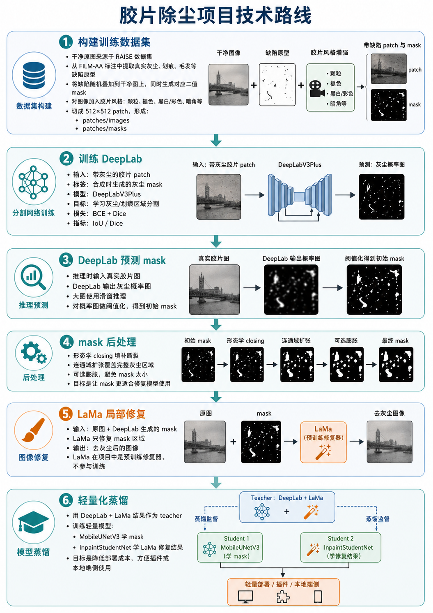

# LAMALocal

[English README](../README.md)



LAMALocal 是一个面向胶片扫描图像的本地灰尘与划痕清理工作流。  
这个仓库包含模型训练脚本、推理工具、导出工具，以及用于 Lightroom 插件流程的打包辅助脚本。

## 项目包含的内容

- 基于 DeepLab 的灰尘掩码预测
- 使用本地 LaMa 进行修复
- 轻量移动端模型蒸馏与导出
- 用于训练的数据集准备脚本
- 用于打包和批量训练的 PowerShell 辅助脚本

## 环境准备

先创建并激活 Python 虚拟环境，再安装依赖：

```powershell
python -m venv .venv
.\.venv\Scripts\activate
pip install -r requirements.txt
```

除非特别说明，以下命令都在仓库根目录执行。

## 训练数据集

如果你想在本地复现训练流程，可以通过下面的百度网盘链接下载已经整理好的数据集：

- 文件：`Dataset.zip`
- 链接：`https://pan.baidu.com/s/1xR4B9weKeHp_P7dTsFUw7w`
- 提取码：`cru3`

解压后请将 `Dataset/` 目录放在仓库根目录下。

## 常用用法

### 1. 在数据集上训练 DeepLab

```powershell
python -m scripts.train_deeplab_dataset `
  --image-dir Dataset\FakeFilmBW\patches\images `
  --mask-dir Dataset\FakeFilmBW\patches\masks `
  --output-prefix checkpoints\fakefilmbw_deeplab
```

### 2. 使用 DeepLab + LaMa 执行本地推理

```powershell
python -m scripts.infer_deeplab_lama `
  --input path\to\images `
  --output-dir outputs\deeplab_lama
```

### 3. 训练移动端修复学生模型

```powershell
python -m scripts.train_inpaint_distill `
  --target-dir path\to\lama_teacher_outputs
```

### 4. 导出移动端模型

```powershell
python -m scripts.export_mobile `
  --model seg `
  --checkpoint checkpoints\fakefilmcolor_deeplab_best.pth `
  --output outputs\mobile\seg_model.ts
```

## PowerShell 辅助脚本

`tools/` 目录下提供了一些适合本地重复执行的辅助脚本：

```powershell
.\tools\train_fakefilm_sequential.ps1
.\tools\build_lightroom.ps1
```

## 打包 Lightroom 插件

这个仓库自带了 Lightroom 插件的打包流程。

## 已生成的 Lightroom 插件

如果你想直接试用当前已经打好的插件包，可以使用下面的百度网盘链接：

- 文件：`LAMALocalDust.lrplugin.zip`
- 链接：`https://pan.baidu.com/s/17JvMyCRf9rX1DLEEuTx3Hw`
- 提取码：`ehs9`

### 1. 生成 `.lrplugin` 插件目录

使用下面的打包脚本：

```powershell
.\tools\build_lightroom.ps1
```

如果还需要同时生成 zip 压缩包：

```powershell
.\tools\build_lightroom.ps1 -Zip
```

输出位置：

- `dist\LAMALocalDust.lrplugin`
- 可选：`dist\LAMALocalDust.lrplugin.zip`

打包前需要确认这些文件已经存在：

- `LAMALocalDust.lrplugin\` 插件源目录
- `checkpoints\best_model.pth`
- `model_cache\hub\checkpoints\big-lama.pt`
- `scripts\infer_deeplab_lama.py`

### 2. 生成插件内的可执行文件

如果还需要继续生成插件内的可执行文件，可以执行：

```powershell
.\tools\build_lightroom.ps1 -BuildExe
```

如果希望一次完成插件目录、可执行文件和 zip 包：

```powershell
.\tools\build_lightroom.ps1 -BuildExe -Zip
```

输出位置：

- `dist\LAMALocalDust.lrplugin\bin\LAMALocalDust\LAMALocalDust.exe`

## 项目结构

- `lamalocal/`：核心 Python 包，包含配置、数据集、模型、指标、损失函数和通用工具
- `scripts/`：训练、推理、导出和数据准备的 Python 入口脚本
- `tools/`：PowerShell 辅助脚本
- `docs/`：补充文档
- `Dataset/`：本地数据集
- `checkpoints/`：模型权重与训练检查点
- `logs/`：训练和工具日志
- `model_cache/`：缓存的模型文件
- `outputs/`：推理结果和导出结果
- `build/`、`dist/`：打包产物目录

## 说明

- 部分脚本默认要求本地已经存在模型文件和数据集。
- 有些脚本里的默认路径带有当前项目环境特征，换机器后可能需要调整。
- 如果要打包 Lightroom 插件，请先确认必需的模型文件已经准备好，再执行构建脚本。
